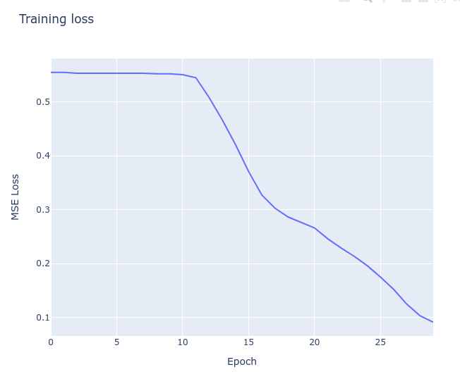
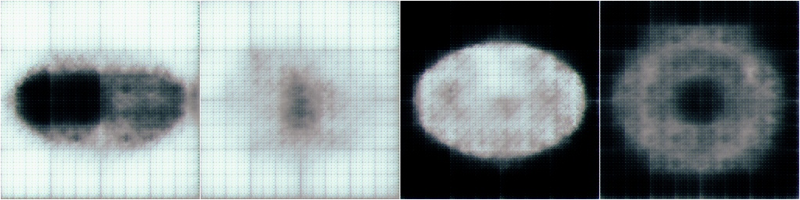
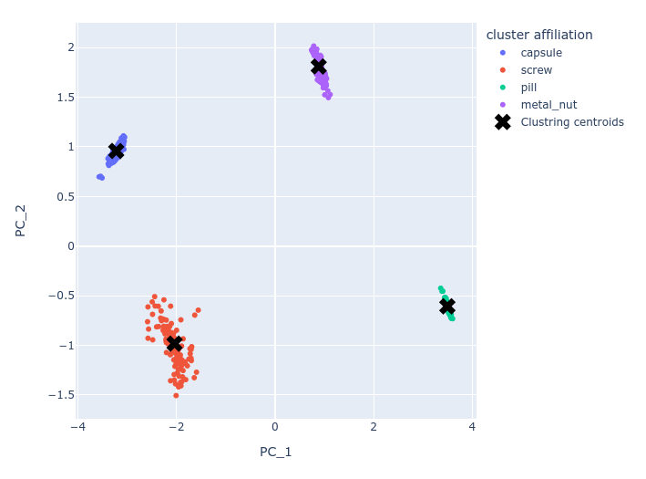

# UVEye assignment
## Overview
This solution uses an auto-encoder to create latent representations of the training samples. We then train a
dimensionality reduction algorithm and a clustering algorithm on these representations. \
During test time, we produce latent representations of the testing samples, reduce their dimension and assign to
the nearest cluster centroid. \
Lastly, we use the class size prior given in the instructions to name each centroid with a phisically relevant name - 
Screw, Pill, ... \
\


## Pre-requisites
- **data** \
  The data structure expected should be:
  ```bash
  /path/to/data
  /path/to/data/black_white_dataset
  /path/to/data/black_white_dataset/train/BG_COLOR
  /path/to/data/black_white_dataset/test/BG_COLOR
  /path/to/data/categories_dataset
  /path/to/data/categories_dataset/test/CLASS
  ```
  Where inside `black_white_dataset` and `categories_dataset` the directory structure is the same as in the assignment 
  zip file.
- **GPU**: A nice addition that will reduce training run-time by ~3x, but not strictly-necessary as the run-times are
  already low.


## Installation
This code was developed with:
- **Python 3.10** - Other python versions may not be compatible.
- **Linux Kubuntu 22.04** - Pythons cross-platform capabilities means the code *should* work with other
  operating systems, but that wasn't tested.

Download the code: \
`git clone git@github.com:moyrml/UVEye_HomeAssignmentML.git` \
Before proceeding, it is best to create a virtual environment. \
To install dependencies: \
`pip install -r requirements.txt`


## Training
1. **Train AutoEncoder** \
  `python train_ae.py --data_location /path/to/data/black_white_dataset --reduce_lr` \
  Take note to write down the output directory of the above code, as these models will be used for the rest of the 
  pipeline (it is the first thing that's printed to the screen).
1. **Produce embeddings for the training set** \
  Not specifying model path will result in the code taking the *last* model trained. \
  `python create_latent_vectors.py --set_type=train --data_location=/path/to/data/black_white_dataset/`
1. **Train on the embeddings** \
  This step will train a PCA dimension reduction and KMeans clustering with 4 clusters on the training set. \
  `python train_embeddings.py --data_location=/path/to/data/black_white_dataset/`
1. **Produce embeddings for the testing set** \
  `python create_latent_vectors.py --data_location /path/to/data/categories_dataset/ --set_type=test`
1. **Test on the test embeddings** \
  `python UVEye_HomeAssignmentML/test_embeddings.py` \

## Results
Using the default hyperparameters the AutoEncoder model achieves the following loss curve (MSE loss):

 \
Note that it seems the loss has not converged. Tests in which the loss fully converged has produced "better"
auto-encoder, but poorer embeddings. Thous could be the result of over-fit: learning to distinguish samples
by minute details, rather than parts relevant to the task at hand.

Representative reconstructions of the test set:



This encoder produces the following *testing set* embeddings (PCA reduced to 2 dimensions, 
KMeans cluster centroids found on the *training set* embeddings are overlaid and denoted by "X"):



Note that we name the clusters according to the class size prior given in the instruction. Hence, the clusters 
in the above plot have names rater than numerical ids. \
Therefore, were we obtain a confusion matrix: 
```
cluster affiliation  capsule  metal_nut  pill  screw
label                                               
capsule                142.0        0.0   0.0    0.0
metal_nut                0.0       92.0   0.0    0.0
pill                     0.0        0.0  93.0    0.0
screw                    0.0        0.0   0.0  111.0
```